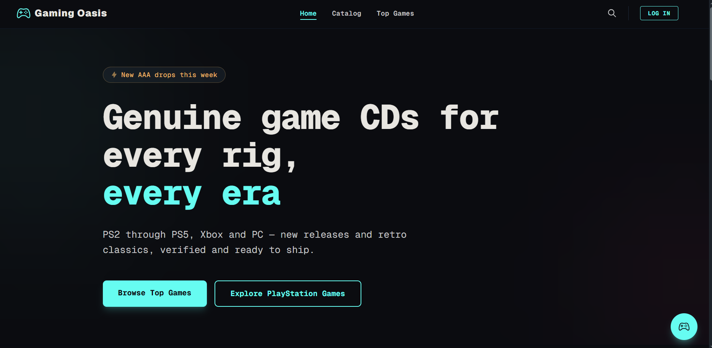
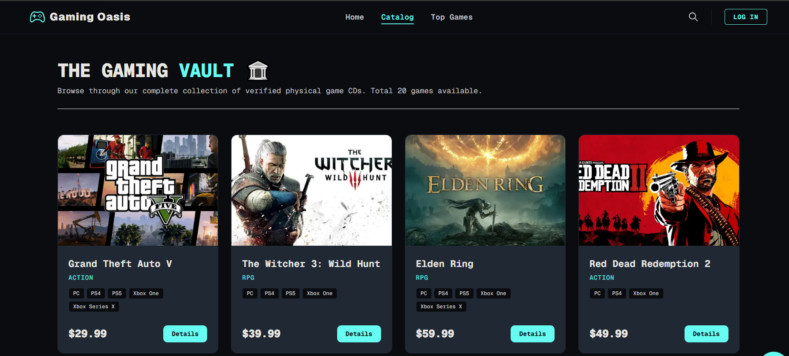
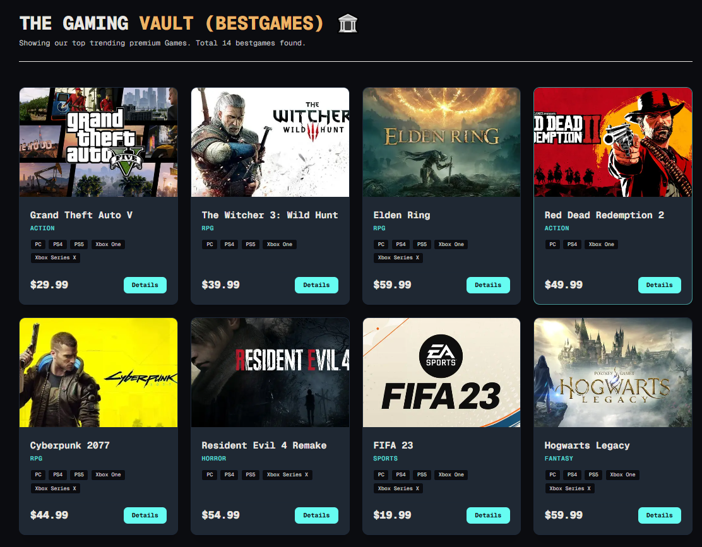
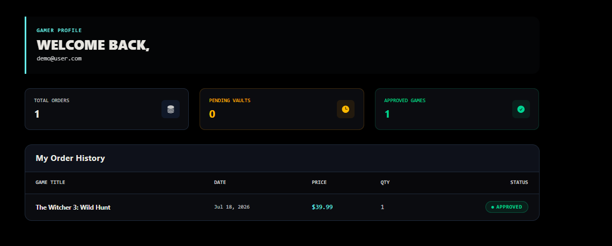
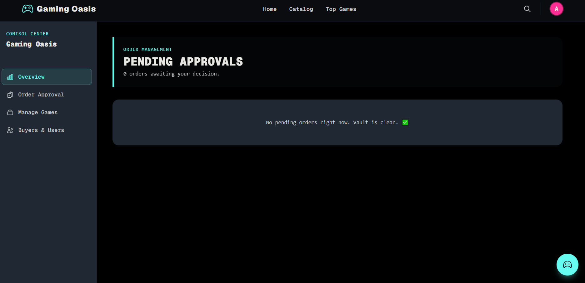
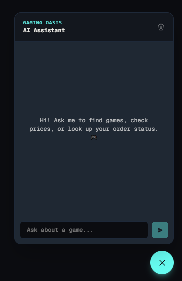
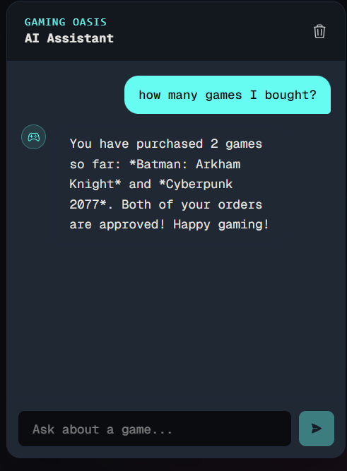

<div align="center">

# 🎮 Gaming Oasis

### Premium Game CD & Digital Marketplace

*Genuine game CDs for every rig, every era — PS2 to PS5, Xbox, and PC.*


</div>

---

## 🕹️ Overview

**Gaming Oasis** is a dark-mode, neon-accented premium marketplace where users can browse, buy, and track verified physical game CDs — while admins control the entire vault, order approvals, and buyer analytics. A built-in **Gemini-powered AI assistant** helps users find games, check prices, and track their own orders.

---

## ✨ Screenshots

### 🏠 Home


### 🗂️ Catalog — The Gaming Vault


### 🏆 Top Games



### 👤 User Dashboard


### 👑 Admin Control Center


### 🤖 AI Assistant



---

## 🚀 Features

### 🧭 Customer Experience
- 🎮 Premium dark-mode UI — glassmorphism navbar, neon cyan + gold accents
- 🗂️ Full game catalog with platform, category, and price filters
- 🛒 Instant order request flow — admin-approved before finalizing
- 📊 Personal dashboard — order history, status tracking (pending/approved/rejected)
- 🤖 **AI Chat Assistant** (Gemini) — game search, price lookup, order status, tools + memory

### 👑 Admin Control Center
- 📈 Executive overview — total revenue, orders, live titles, active gamers
- ✅ Order Approval System — approve/reject pending orders, auto stock deduction
- 🕹️ Manage Games (CD Vault) — add/edit/delete titles, live stock control
- 👥 Buyer Data & Users — customer directory with spend/order tracking

---

## 🛠️ Tech Stack

| Layer        | Stack                                                                                |
| ------------ | ------------------------------------------------------------------------------------ |
| **Frontend** | Next.js (App Router), TypeScript, Tailwind CSS, daisyUI, react-icons, react-toastify |
| **Backend**  | Express.js, Node.js, TypeScript, MongoDB, CORS, dotenv                               |
| **Auth**     | better-auth + MongoDB adapter (handled on the frontend)                              |
| **AI**       | Google Gemini (`@google/genai`) — function calling + tool-based chat assistant       |
| **Database** | MongoDB Atlas                                                                        |

---

## 📁 Project Structure

```
gaming-oasis-frontend/          gaming-oasis-backend/
├── src/                        ├── index.ts
│   ├── app/                    ├── tsconfig.json
│   │   ├── admin/               └── package.json
│   │   ├── dashboard/
│   │   ├── catalog/
│   │   ├── api/ai/chat/
│   │   └── ...
│   ├── components/
│   ├── lib/
│   ├── hooks/
│   └── types/
```

Frontend and backend are kept as fully separate projects (not a monorepo) — the backend stays lean (just `index.ts` + routes), while all session/auth logic is centralized on the frontend.

---

## ⚙️ Getting Started

### Prerequisites
- Node.js (latest LTS)
- MongoDB Atlas connection string
- Gemini API key ([Google AI Studio](https://aistudio.google.com))

### 1️⃣ Backend Setup

```bash
cd gaming-oasis-backend
npm install
```

Create a `.env` file:
```env
PORT=5000
MONGODB_URI=mongodb_connection_string
DB_NAME=database_name
```

Run:
```bash
npm run dev
```

### 2️⃣ Frontend Setup

```bash
cd gaming-oasis-frontend
npm install
```

Create a `.env.local` file:
```env
NEXT_PUBLIC_BACKEND_URL=http://localhost:5000
MONGODB_URI=mongodb_connection_string
BETTER_AUTH_SECRET=better_auth_secret
BETTER_AUTH_URL=http://localhost:3000
GEMINI_API_KEY=gemini_api_key
```

Run:
```bash
npm run dev
```

The frontend runs on `http://localhost:3000`, the backend on `http://localhost:5000`.

---

## 🤖 AI Assistant — Example Questions (English & বাংলা)

| 🇬🇧 English                                | 🇧🇩 বাংলা                          |
| ---------------------------------------- | ----------------------------- |
| Is Elden Ring in stock?                  | Elden Ring আছে কিনা?             |
| What's the price of GTA V?               | GTA V-এর দাম কত?               |
| Which platforms is FIFA available on?    | FIFA কোন কোন প্ল্যাটফর্মে available? |
| What's the cheapest game available?      | সবচেয়ে কম দামের গেম কোনটা?           |
| What games are under $30?                | ৩০ ডলারের নিচে কী কী গেম আছে?         |
| What's available in the Action category? | Action ক্যাটাগরিতে কী আছে?           |
| Show PS5 games, cheapest first           | PS5-এর গেম দেখাও, দাম কম থেকে বেশি    |
| What's my order status?                  | আমার অর্ডার স্ট্যাটাস কী?             |
| How many games have I ordered?           | আমি কয়টা গেম কিনেছি?                |
| Do I have any pending orders?            | আমার কোনো pending অর্ডার আছে?       |

> 💡 The assistant automatically mirrors your language — ask in English, get English back; ask in Bengali, get Bengali back.

---

## 🎨 Theme

| Token    | Hex       | Usage                   |
| -------- | --------- | ----------------------- |
| Obsidian | `#0B0C10` | Background              |
| Carbon   | `#1F2833` | Cards / panels          |
| Cyan     | `#66FCF1` | Primary highlight, CTAs |
| Gold     | `#ECB365` | VIP / premium accents   |
| Crimson  | `#FF2E93` | Alerts, notifications   |
| Fog      | `#C5C6C7` | Secondary text          |
| Ivory    | `#E8E6E1` | Primary text            |

---


##  Live Project Link : ✨ [Visit Gaming Oasis Platform](https://quest-eta-one.vercel.app) 

<div align="center">

**Built with 🎮 for gamers, by gamers.**

</div>